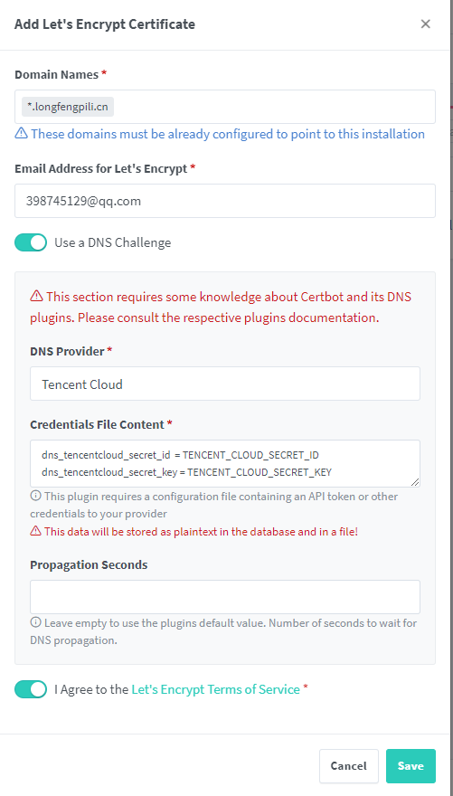

# 申请证书

# 功能
1. **Proxy Hosts（代理主机）**：
   用途：代理主机用于将外部的网络请求转发到您内部网络中的服务器或服务。它可以隐藏真实的后端服务器地址，提供负载均衡、缓存静态内容、压缩请求、加密和SSL终端等功能。
   应用场景：常用于正向代理服务器配置，例如，将公网的HTTP(S)请求转发到内网的Web服务器。

2. **Redirection Hosts（重定向主机）**：
   用途：重定向主机用于自动将到达特定URL或域名的请求重定向到另一个URL或域名。这通常涉及HTTP状态码301（永久重定向）或302（临时重定向）。
   应用场景：当您迁移网站到新域名，但希望保持旧域名的访问者能够访问到新位置时，或者在维护页面和重构网站时临时重定向流量。

3. **Streams（流）**：
   用途：流通常用于TCP和UDP流量的端口转发。与代理主机不同，流直接在网络层上操作，没有HTTP协议的处理。
   应用场景：常用于需要处理非HTTP/S协议的服务，比如FTP、SMTP、游戏服务器或其他基于TCP/UDP的服务。

4. **404 Hosts（404主机）**：
   用途：404主机配置用于定义当请求的内容在服务器上找不到时返回的自定义404错误页面。
   应用场景：用于提高用户体验，当用户请求不存在的页面时，显示一个友好的错误消息而不是默认的服务器错误页面。

# Proxy Hosts
## details

- **域名**：`test.longfengpili.cn`，这是您希望配置的子域名。
- **协议**：`http`，表示使用的是HTTP协议。
- **转发主机名/IP**：`longfengpili.cn`，这是请求将被转发到的目标主机名或IP地址。
- **转发端口**：`1111`，这是目标主机上的端口，即请求将被转发到的端口。

- **缓存资产**：这个选项当前未启用，表示不会缓存静态资产。
- **阻止常见漏洞**：这个选项已启用，表示系统会自动阻止一些常见的网络漏洞攻击。
- **Websockets支持**：这个选项当前未启用，如果您的应用需要使用Websockets技术，则可能需要启用它。
- **访问列表**：设置为“公开可访问”，表示没有IP访问限制。

## SSL
- **SSL证书**：用于指定SSL证书的域名，这里显示为 `test.longfengpili.cn`。
- **强制SSL**：启用后，所有进入此代理主机的HTTP流量将被重定向到HTTPS，确保加密通信。
- **HTTP/2支持**：已启用，表示此代理将支持HTTP/2协议，这是一种性能更优的网络协议，提供更快的页面加载时间。
- **HSTS启用**：这通常表示HTTP Strict Transport Security（HSTS）已启用。启用HSTS后，浏览器会记住该站点只能通过HTTPS进行访问，这有助于防止SSL剥离攻击。
- **HSTS子域名**：如果启用，所有的子域名也将强制使用HTTPS。
